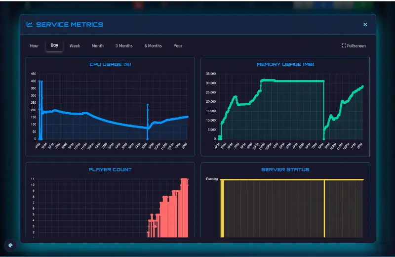
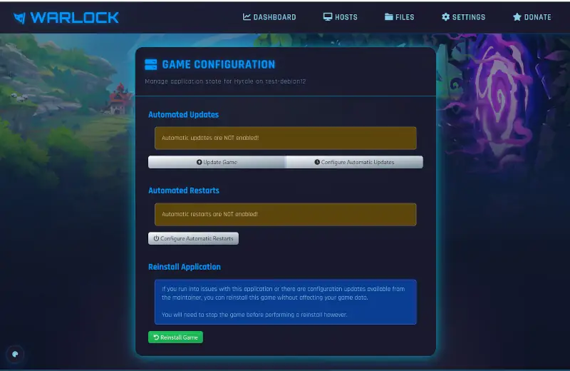
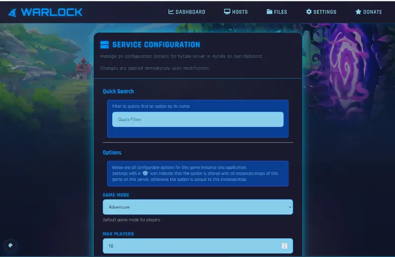

# Hytale Dedicated Server Installer

Installer for Hytale for dedicated servers running Debian or Ubuntu Linux.

## Installation

Manual installation can be done by downloading [the installer](dist/installer.sh) and running on your server.

For easier installs, it is recommended to use [Warlock Game Server Manager](https://bitsnbytes.dev/pages/projects/warlock/index.html)
 which can automate the installation and management of Hytale servers.

## What this installer does

This sets up a dedicated user account for running the Hytale server, downloads the server files, and sets up a systemd service to manage the server.

Additionally, it provides a management script for performing tasks like retrieving game metrics, updating the server, and backing up game data.

The management script (manage.py) can be used manually or with Warlock.

These features are available within Warlock, but also provided to a lesser degree from the command line via manage.py.

## First Installation

When installing for the first time, pay close attention to the prompts, as the server will prompt visiting a specific URL
to authorize your server instance to your account.

If using Warlock, **do not close the page** when it asks, instead open the link in a new tab!

## Early Access

The game is in very early access, so not all features may be functional yet.
(For example Warlock can provide a list of players online, but that's currently buggy at the time of writing.)