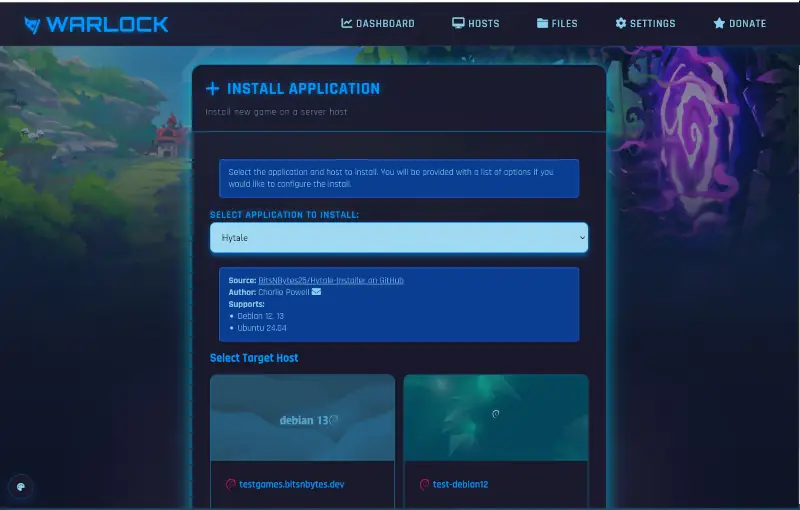

# Hytale Dedicated Server Installer

Installer for Hytale for dedicated servers running Debian or Ubuntu Linux.

## Installation

Manual installation can be done by downloading [the installer](dist/installer.sh) and running on your server.

For easier installs, it is recommended to use [Warlock Game Server Manager](https://bitsnbytes.dev/pages/projects/warlock/index.html)
 which can automate the installation and management of Hytale servers.

## What this installer does

This sets up a dedicated user account for running the Hytale server, downloads the server files, and sets up a systemd service to manage the server.

Additionally, it provides a management script for performing tasks like retrieving game metrics, updating the server, and backing up game data.